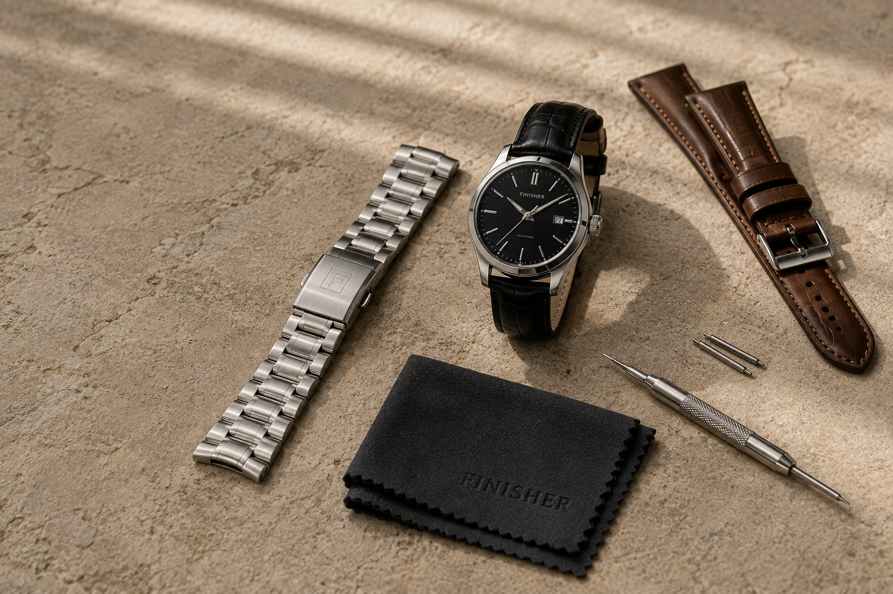

# FINISHER — Image Assets Required

## Overview
All Unsplash hotlinks have been replaced with local image paths. The HTML now references a local `images/` folder. 

Below is the complete list of image files needed to complete the FINISHER mock-up.

---

## Image Folder Structure

Create the following directory in your workspace:
```
watch-accessories-mockup/
├── images/
│   ├── hero.jpg
│   ├── category-watch.jpg
│   ├── category-carry.jpg
│   ├── category-jewellery.jpg
│   ├── category-eyewear.jpg
│   ├── category-exchange.jpg
│   ├── product-leather-strap-cognac.jpg
│   ├── product-rubber-strap-navy.jpg
│   ├── product-watch-roll-charcoal.jpg
│   ├── product-tool-set.jpg
│   ├── product-care-kit.jpg
│   ├── product-fabric-strap-olive.jpg
│   └── about-accessories.jpg
```

---

## Detailed Image Specifications

### 1. HERO SECTION

**Filename:** `images/hero.jpg`

**Location on page:** Full-width hero with split text/image layout (desktop)

**Dimensions:** Recommended 1200px wide × 600px tall minimum (aspect ratio ~2:1)

**Content:** Premium editorial composition of men's accessories

**What to photograph:**
- A carefully arranged flat-lay or still life of premium men's accessories
- Include at least 2–3 of: luxury watch, leather strap/bracelet, quality wallet, cardholder, sunglasses, jewellery
- Minimalist, restrained composition with neutral background (light wood, marble, concrete, or plain surface)
- Professional product/editorial lighting
- Avoid cluttered arrangement; aim for considered spacing
- Monochromatic or warm-toned palette preferred
- No perfume/cologne (not a FINISHER category)

**Current situation:** Unsplash photo was a generic watch – misaligned with multi-category concept

**Fallback:** If unavailable, this is most critical to replace first

---

### 2–6. CATEGORY CARDS

These 5 images appear in the "Our Collections" section, displayed in a responsive grid.

**Dimensions (each):** Recommended 600px wide × 400px tall minimum (aspect ratio ~3:2)

**Treatment:** Consistent premium editorial style; should feel like a cohesive collection

#### 2a. `images/category-watch.jpg`
- **Section:** WATCH category card (first card)
- **Content:** A quality men's watch, watch strap, watch roll/case or watch-related detail
- **Examples:** Leather watch strap on a flat surface, wrist shot of a watch, folded watch roll, watch on a plain background
- **Tone:** Premium, masculine, understated
- **Avoid:** Women's watches, cheap-looking plastic, oversaturated colours

#### 2b. `images/category-carry.jpg`
- **Section:** CARRY category card (second card)
- **Content:** Premium men's cross-body bag, wallet, cardholder or key organiser
- **Examples:** Leather or canvas bag (flat-lay or styled), slim wallet on wood surface, cardholder in use, key organiser detail
- **Tone:** Practical elegance, travel-ready aesthetic
- **Avoid:** Generic handbags, women's accessories, oversized cluttered shots

#### 2c. `images/category-jewellery.jpg`
- **Section:** JEWELLERY category card (third card)
- **Content:** Understated men's jewellery — preferably a simple chain or bracelet
- **Examples:** Stainless steel or silver chain on a plain background, minimal bracelet, subtle detail shot
- **Tone:** Refined, masculine restraint
- **Avoid:** Ornate women's jewellery, large statement pieces, overly shiny/gaudy styling

#### 2d. `images/category-eyewear.jpg`
- **Section:** EYEWEAR category card (fourth card)
- **Content:** Premium masculine/unisex sunglasses
- **Examples:** Sunglasses on a surface (front or three-quarter view), wrist shot with glasses, detail of frames
- **Tone:** Timeless, masculine, quality-focused
- **Avoid:** Bright fashion-forward frames, pink/ornate styles, women's sunglasses

#### 2e. `images/category-exchange.jpg`
- **Section:** THE EXCHANGE category card (fifth card)
- **Content:** A tasteful pre-owned mechanical/luxury-style watch or watch collection
- **Examples:** Vintage or collectible watch, two or three watches arranged, watch with patina/character, collector's photography style
- **Tone:** Editorial, collector-focused, slightly more textured than WATCH category (feel of "story" or "history")
- **Avoid:** Modern mass-market watches, cheap-looking damaged goods, cluttered chaos

---

### 7–12. PRODUCT CARDS

These 6 images appear in "The Edit" section, displayed in a responsive product grid.

**Dimensions (each):** Recommended 500px wide × 350px tall minimum (aspect ratio ~1.4:1)

**Treatment:** Product-focused, clean photography. Each image must clearly depict the specific product described.

#### 7. `images/product-leather-strap-cognac.jpg`
- **Product:** Heritage Leather Strap – Cognac
- **Content:** Vegetable-tanned leather watch strap in cognac/tan colour
- **Examples:** Strap laid flat on a plain surface, strap worn on a wrist/watch, detail of hand-finished edges, single strap showcase
- **Tone:** Warm, natural leather tone; show texture and quality
- **Avoid:** Wrong colour (not cognac), synthetic-looking leather, women's straps

#### 8. `images/product-rubber-strap-navy.jpg`
- **Product:** Performance Rubber Strap – Navy
- **Content:** Water-resistant FKM rubber sports strap in navy colour
- **Examples:** Strap on a watch, strap laid flat showing texture, detail of quick-release hardware
- **Tone:** Clean, sporty, show the functional hardware/details
- **Avoid:** Cognac leather (different product!), wrong colour, overly glossy rendition

#### 9. `images/product-watch-roll-charcoal.jpg`
- **Product:** Canvas Watch Roll – Charcoal
- **Content:** Waxed canvas watch roll/storage roll in charcoal/dark grey
- **Examples:** Roll from outside (closed), roll open showing watch slots, roll with watches inside, flat-lay detail, hand holding roll
- **Tone:** Practical, structured, show the construction quality
- **Avoid:** Random bag, wrong colour, unravelled mess

#### 10. `images/product-tool-set.jpg`
- **Product:** Precision Tool Set – Stainless Steel
- **Content:** Spring bar remover, link remover, micro screwdriver and leather pouch (watch service tools)
- **Examples:** Tools laid out, tools in leather pouch, close-up of individual tools, tools in use on a watch
- **Tone:** Professional, functional, clean stainless steel
- **Avoid:** Generic laptop hardware, other tools, rough/rusty look

#### 11. `images/product-care-kit.jpg`
- **Product:** Care Kit – Complete
- **Content:** Watch care kit with microfiber cloths, cleaning solution, and soft brush
- **Examples:** Kit contents displayed, kit in presentation box, microfibre cloth in use, bottles/containers arranged
- **Tone:** Premium, organised, show quality of included items
- **Avoid:** Random cleaning supplies, harsh/ugly bottles, chaotic arrangement

#### 12. `images/product-fabric-strap-olive.jpg`
- **Product:** Technical Fabric Strap – Olive
- **Content:** Military-grade nylon fabric strap in olive colour (with stainless steel hardware)
- **Examples:** Strap on a watch, strap laid flat showing texture, detail of hardware, single strap showcase
- **Tone:** Rugged but refined, show the fabric weave and hardware quality
- **Avoid:** Cognac leather, wrong colour, cheap nylon look

---

### 13. ABOUT SECTION

**Filename:** `images/about-accessories.jpg`

**Location on page:** Right column of "The Finisher Approach" section (desktop layout)

**Dimensions:** Recommended 600px wide × 600px tall minimum (square or slightly taller)

**Content:** Premium men's accessories in an editorial/curated arrangement

**What to photograph:**
- A curated flat-lay or still-life of multiple premium accessories (watch, wallet, jewellery, strap, bag detail, etc.)
- More "collected" and "intentional" than hero; show curation philosophy
- Clean, well-lit, neutral background
- Professional arrangement with breathing room
- Can be more complex/layered than hero (shows "collection")

**Tone:** Editorial, thoughtful, premium restraint

**Current situation:** Unsplash photo was generic – can work if visually appropriate, but should ideally be replaced with themed content

**Fallback:** This is lower priority than hero and product cards; can remain generic longer if needed

---

## Image Format & Technical Requirements

### File Format
- **Recommended:** JPG (photographs) or WebP (modern format)
- **Size:** Optimise for web (100–300KB per image ideal; aim for <500KB)
- **Colour space:** sRGB
- **Resolution:** 72–96 DPI (screen resolution)

### Aspect Ratios to Maintain
| Image Type | Recommended Ratio | Pixels |
|---|---|---|
| Hero | 2:1 | 1200×600 |
| Category Cards | 3:2 | 600×400 |
| Product Cards | 1.4:1 | 500×350 |
| About Section | ~1:1 | 600×600 |

### CSS Handling
All images use `object-fit: cover` in CSS, which means:
- Images will be cropped to fit the container
- Focal point should be centered in the photograph
- No distortion/stretching
- Consistent visual treatment across mismatched source aspect ratios

---

## Fallback Behaviour

If an image file is missing:
- The browser will display a broken image icon (small)
- Alt text will be visible on hover (screen readers will read it)
- The layout will NOT collapse or distort
- The page remains accessible and readable

To test locally:
1. Create the `images/` folder
2. Add placeholder JPG files (any content)
3. The site will load without errors
4. Replace with correct images as they're sourced

---

## Sourcing Recommendations

### For Premium Editorial Imagery:
- **Free with attribution:** Unsplash, Pexels, Pixabay (search "watch", "leather wallet", "sunglasses", "jewellery")
- **Affordable stock:** Shutterstock, Getty Images, iStock (search professional/editorial styles)
- **Custom photography:** Ideal for credibility (shoot your own prototypes or loan accessories)
- **AI-generated:** Midjourney, DALL-E, Stable Diffusion (brief: "professional product photography, minimalist, premium men's accessories")

### Search Terms That Work:
- "luxury watch strap leather"
- "men's leather wallet flat lay"
- "premium sunglasses product photography"
- "stainless steel watch tools"
- "men's gold chain jewellery minimal"
- "vintage mechanical watch"
- "canvas toiletry bag brown"
- "watch care kit accessories"

---

## Current HTML File Changes

All references in `index.html` have been updated from:
```html

```

To:
```html

```

No HTML or CSS changes are required beyond image population.

---

## Next Steps

1. Create the `images/` folder in the project root
2. Source or create the 13 image files listed above
3. Save them with the exact filenames specified (case-sensitive on Linux/Mac)
4. Test the site locally to confirm all images load
5. When satisfied, the site is ready for deployment

---

**Last Updated:** 2026-08-13  
**Status:** Images pending — HTML structure ready for local assets
